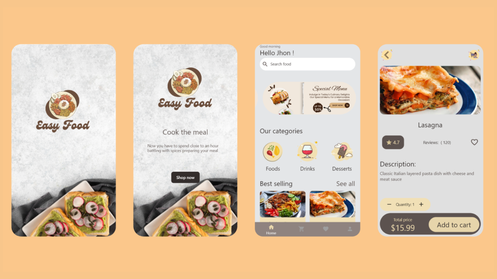

# Title: Easy Food - Your Convenient Food Ordering App

# Overview
Easy Food is a cutting-edge food delivery application that aims to simplify the way people order their favorite meals. Leveraging the power of Flutter for a seamless user interface, Node.js for efficient data retrieval, and Laravel for secure user authentication, Easy Food provides a hassle-free platform for users to browse, customize, and place their food orders with ease.

## Screenshot 📷
  

# Key Features
# Intuitive User Interface
Easy Food offers an intuitive and user-friendly interface, ensuring a smooth and enjoyable browsing experience. Carefully crafted layouts and user-friendly controls make it easy for users to explore a wide variety of food options effortlessly.

# Extensive Food Selection
Discover a vast selection of dishes, each offering its unique taste, style, and culinary delight. From traditional comfort food to exotic cuisines, Easy Food has something to satisfy every palate.

# Customizable Orders
Easy Food allows users to customize their orders to meet their preferences. Whether it's adjusting ingredients, spice levels, or portion sizes, you can tailor your meal to your liking.

# Secure User Authentication
Our application utilizes the robust Laravel framework for secure user authentication and data protection, ensuring that your personal information remains safe and confidential.

# Effortless Cart Management
With our integrated cart system, you can easily review your selected items, make changes, and proceed to checkout with confidence. Managing quantities, adding special requests, and applying discounts is a breeze.

# Responsive Design
Easy Food is designed to provide a consistent and delightful experience across all devices, whether you're ordering from your smartphone, tablet, or desktop.

# Getting Started
If you're new to Flutter development, here are some resources to help you get started with this project:

Flutter Documentation: Explore comprehensive documentation, tutorials, and samples to kickstart your Flutter journey.
Node.js Documentation: Learn more about Node.js for building efficient backend services.
Laravel Documentation: Dive into the Laravel framework to enhance authentication and user data handling in your app.

